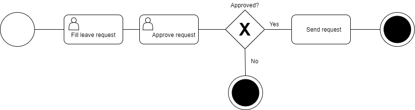

# 一个基于ViewFlow的BPM应用

[viewflow](https://github.com/viewflow/viewflow)

缘由：考察了几家BPM厂商后，发现现有基于.NET/JAVA的BPM系统，都过于复杂。发现这个 ViewFlow 似乎代码质量高，界面操作简洁，故选用这个框架。

目的：计划与M$ Active Directory集合，在 ViewFlow 基础上，制作工作流的BPM无纸化办公系统。

## 起步

为 senscomm 项目创建一个全新的虚拟环境。在一个空目录里运行以下命令：

```bash
python3 -m venv env
source env/bin/activate
```

首先将 `viewflow` 与 `django-material` 包安装好，以获得一个预构建好的前端界面。

```bash
pip install django django-material django-viewflow
```

在当前目录里，启动一个新的 django 项目：

```bash
django-admin startproject senscomm .
```

在 `senscomm` 文件夹下创建一个 `leave` 文件夹（后面将以此作为 `senscomm` 项目的 `leave` 应用的目标文件夹）

```bash
mkdir senscomm/leave
```

创建一个应用：

```bash
./manage.py startapp leave senscomm/leave
```

现在就应该有以下这样的文件结构了:

```bash
.
├─── LICENSE
├── manage.py
├── README.md
├── requirements.txt
└── senscomm
    ├── asgi.py
    ├── __init__.py
    ├── leave
    │   ├── admin.py
    │   ├── apps.py
    │   ├── __init__.py
    │   ├── migrations
    │   │   └── __init__.py
    │   ├── models.py
    │   ├── tests.py
    │   └── views.py
    ├── __pycache__
    │   ├── __init__.cpython-38.pyc
    │   └── settings.cpython-38.pyc
    ├── settings.py
    ├── urls.py
    └── wsgi.py

```

## 配置

打开 `demo/settings.py`，将 `viewflow` 与 `senscomm.leave` 添加到 `INSTALLED_APPS` 的设置中：

```python
INSTALLED_APPS = [
    ...
    'viewflow',
    'senscomm.leave',
]
```

## 模型定义

打开 `senscomm/leave/models.py` 文件，通过`reason`与`approved`字段，来定义一个流程（process），从而实现在流程执行过程中，对流程状态进行捕获。

```python
from django.db import models
from viewflow.models import Process

class LeaveProcess(Process):
    reason = models.CharField(max_length=150)
    approved = models.BooleanField(default=False)
```

## 流的定义（Define flow）

先来看看流的 BPMN 图表（business process model and notation diagram, 业务流程建模与标注图表）。后面就要将图表中的各个形状，映射到相应的节点定义。




