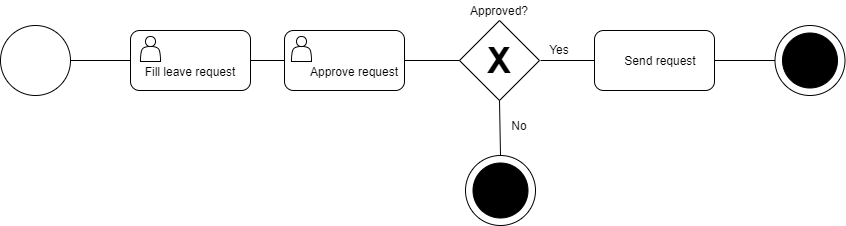

# 起步

为 senscomm 项目创建一个全新的虚拟环境。在一个空目录里运行以下命令：

```bash
python3 -m venv env
source env/bin/activate
```

首先将 `viewflow` 与 `django-material` 包安装好，以获得一个预构建好的前端界面。

```bash
pip install django django-material django-viewflow
```

在当前目录里，启动一个新的 django 项目：

```bash
django-admin startproject senscomm .
```

在 `senscomm` 文件夹下创建一个 `leave` 文件夹（后面将以此作为 `senscomm` 项目的 `leave` 应用的目标文件夹）

```bash
mkdir senscomm/leave
```

创建一个应用：

```bash
./manage.py startapp leave senscomm/leave
```

现在就应该有以下这样的文件结构了:

```bash
.
├─── LICENSE
├── manage.py
├── README.md
├── requirements.txt
└── senscomm
    ├── asgi.py
    ├── __init__.py
    ├── leave
    │   ├── admin.py
    │   ├── apps.py
    │   ├── __init__.py
    │   ├── migrations
    │   │   └── __init__.py
    │   ├── models.py
    │   ├── tests.py
    │   └── views.py
    ├── __pycache__
    │   ├── __init__.cpython-38.pyc
    │   └── settings.cpython-38.pyc
    ├── settings.py
    ├── urls.py
    └── wsgi.py

```

## 配置

打开 `demo/settings.py`，将 `viewflow` 与 `senscomm.leave` 添加到 `INSTALLED_APPS` 的设置中：

```python
INSTALLED_APPS = [
    ...
    'viewflow',
    'senscomm.leave',
]
```

## 模型定义

打开 `senscomm/leave/models.py` 文件，通过`reason`与`approved`字段，来定义一个流程（process），从而实现在流程执行过程中，对流程状态进行捕获。

```python
from django.db import models
from viewflow.models import Process

class LeaveProcess(Process):
    reason = models.CharField(max_length=150)
    approved = models.BooleanField(default=False)
```

## 流的定义（Define flow）

先来看看流的 BPMN 图表（business process model and notation diagram, 业务流程建模与标注图表）。后面就要将图表中的各个形状，映射到相应的节点定义。



打开 `senscomm/leave/flows.py` 文件，并做如下定义：

```python
from viewflow import flow
from viewflow.base import this, Flow
from viewflow.flow.views import CreateProcessView, UpdateProcessView

from .models import LeaveProcess

class LeaveFlow(Flow)：
    process_cls = LeaveProcess

    start = (
        flow.Start(
            CreateProcessView,
            fields=["reason"]
        ).Permission(
            auto_create=True
        ).Next(this.approve)
    )

    approve = (
        flow.View(
            UpdateProcessView,
            fields=["approved"]
        ).Permission(
            auto_create=True
        ).Next(this.check_approve)
    )

    check_approve = (
        flow.If(lambda activation: activation.process.approved)
        .Then(this.end)
        .Else(this.end)
    )

    send = (
        flow.Handler = (
            this.send_leave_request
        ).Next(this.end)
    )

    end = flow.End()

    def send_leave_request(self, activation):
        print(activation.process.reason)

```

Viewflow 是从这个 `flows.py` 文件对所有应用的工作流（all application flows）进行处理的。

- 每个工作流都是一个对 `viewflow.base.Flow` 进行子类的 Python 类（Each flow is a Python class that subclasses `viewflow.base.Flow`）
- 每个属性表示的是一个工作流的任务（Each attribute represents a flow task）
- 可使用特定的 `this` 对象，将工作流的各项任务连接起来，并实现转发引用（To connect flow tasks altogether, the special `this` object can be used to make forward references）

`flow.Start` 表示了在 Django 视图中，由某人执行的一项任务。这里仅使用了内建的 `CreateProcessView`，来实现这个教程的目标。但是这里可以使用任何基于由 `@flow.flow_start_view` 装饰器所注释过的类或函数的视图（`flow.Start` represents a task that is performed by a person in a Django view. For the tutorial purpose, we use built-in `CreateProcessView`. But any class or functional based view annotated with `@flow.flow_start_view` decorator can be used here）。

`flow.Task` 是某个既有流程的一项用户任务（`flow.Task` is a user task for an existing process）。

可通过Django 的权限系统，来对任务执行权限（tasks execution rights） 进行限制。在这里可指定一项权限，或通过设置 `auto_create=True`，从而引发该任务的特别权限。在这个示例中，将创建`leave.can_start_leaveprocess` 以及 `leave.can_approve_leaveprocess`连个权限。此外将创建出工作流清单以及管理目的视图下的两个标准权限：`leave.view_leaveprocess` 以及 `leave.manage_leaveprocess`。

`flow.If` 即简单的独占网关。其在可调用的结果基础上，选择出某个输出。对于输入，调用获取到一个任务`activation`，而这个`activation`任务，有事一个对当前任务处理逻辑进行处理的对象，`activation` 又有着 `activation.process` 与 `activation.task` 两个字段，这两个字段，又是由相应的模型实例加以初始化的（`flow.If` is the simple exclusive gateway. It selects an outcome depending on a callable result. For the input, callable gets a task `activation` - an object that handles current task process logic, and that has an `activation.process` and `activation.task` fields initialized with the corresponding model instances）。

若请求被批准，那么`flow.Handler`就将被执行。`flow.Handler`是由同步Python代码调用所执行的任务。这里的`this`引用，可用于指向某个工作流实例的方法，或者任何的 Python 调用对象（If the request is approved, the `flow.Handler` will be executed. `flow.Handler` is the task performed by synchronous Python code call. Here a `this` reference could be used to point to a flow instance method, or any Python callable）。

`flow.End`对该流程进行终结操作，并将其标记为完成状态。

## 前端的开启（Enable frontend）

在这里就可以开始为工作流清单、各种操作、任务详情及任务执行视图等，编写众多的模板。Viewflow 本身就有着预构建的前端模块，提供了可立即使用的UI，只需开启即可。

首先，将所需的 apps 添加到 `INSTALLED_APPS` 中去：

```python
INSTALLED_APPS = [
    ...
    'material',
    'material.frontend',
    'viewflow',
    'viewflow.frontend',
    'senscomm.leave',
]
```

在文件`senscomm/urls.py`中, 将前端的 URLs 添加到全局 URL 配置模块：

```python
from django.urls import include, path
from django.views import generic
from material.frontend import urls as frontend_urls

urlpatterns = [
    path(r'', generic.RedirectView.as_view(url='/workflow', permanent=False)),
    path(r'', include(frontend_urls)),
]
```

最后一步，将我们的工作流，在 `viewflow.forntend`中进行注册。

```python
from viewflow import frontend

@frontend.register
class LeaveFlow(Flow):
    ...
```

## 运行与浏览（Run and explore）


为 leave app 创建迁移：

```bash
./manage.py makemigrations leave
```

应用迁移：

```bash
./manage.py migrate
```

为初始登录，创建一个管理用户：

```bash
./manage.py createsuperuser
```

运行服务器：

```bash
./manage.py runserver
```

前往 [http://127.0.0.1:8000](http://127.0.0.1:8000) , 就可以立即查看到 viewflow 了！
